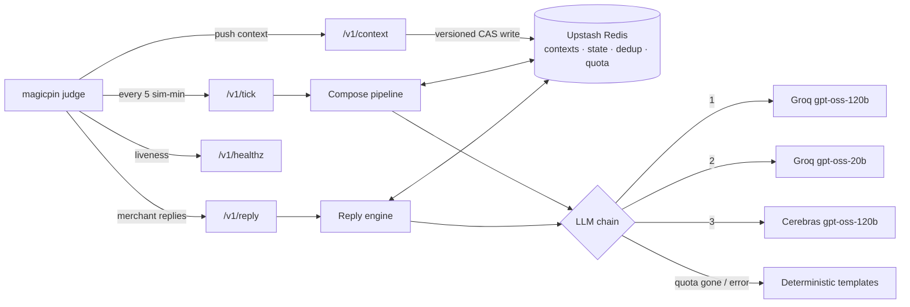
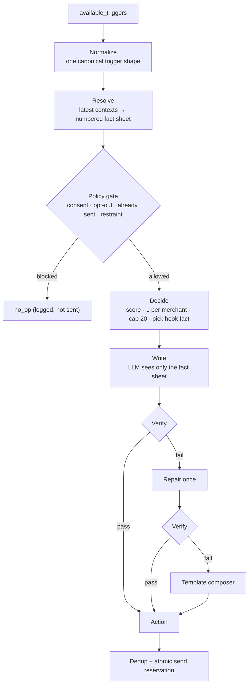
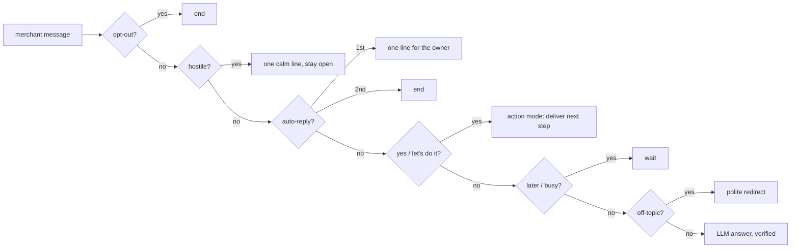

# Vera, rebuilt: a merchant bot that never makes things up

> magicpin AI Challenge submission · FastAPI on Vercel · Upstash Redis · Groq + Cerebras
> Run, test and deploy guide: [`RUNNING_AND_TESTING.md`](RUNNING_AND_TESTING.md)

Most chatbots let the LLM decide *what* to say and *whether* to say it. This one doesn't.

**Code decides. The LLM only writes. A verifier checks every word. If anything fails, a template that is guaranteed correct takes over.**

The result is a bot that can't hallucinate a price, can't double-message a merchant, can't loop on an auto-reply, and always answers within the time limit, even when the LLM is rate-limited or down.

---

## The map



Everything lives in Redis because Vercel functions are stateless. Nothing important is ever held in process memory.

---

## What happens on a tick



**1. Normalize.** Triggers arrive in slightly different shapes (`merchant_id` at the top level or inside `payload`). Everything becomes one canonical object before anything else touches it.

**2. Resolve.** The bot joins trigger → merchant → category → customer, **always using the latest pushed version**. That's how injected data (new digest items, updated performance numbers, a brand-new customer) shows up in the very next message. The output is a closed, numbered fact sheet:

```
F1  CTR 2.1% vs locality median 3.0%
F2  JIDA Oct 2026, p.14: 2,100-patient trial, 38% fewer caries with 3-month recall
F3  Active offer: Dental Cleaning @ ₹299
```

Code does all the arithmetic (days to a deadline, % change, months since a visit), so the LLM never computes a number.

**3. Policy gate.** No consent, opted out, already sent, or merchant still hasn't replied to the last nudge → skip. Holding back is rewarded; spam isn't.

**4. Decide.** Rank by urgency, expiry and freshness. One action per merchant, at most 20 per tick. Choose the single fact the message should lead with.

**5. Write.** The LLM gets the fact sheet, the category's voice and taboo words, the language rule (Hindi-English when the merchant speaks Hindi), and one example. It returns strict JSON at temperature 0.

**6. Verify.** Every number, price, date and name in the body must trace back to a fact. It also rejects taboo words, internal field names, a second question, a wrong salutation, and anything too close to a message already sent. One repair attempt; after that, the template takes over. **Every template passes the same verifier for every trigger kind in the dataset**, so the fallback can't be the weak link.

---

## What happens on a reply

Rules run first, in strict order. The LLM only sees genuine conversation.



Two details that matter:
- **Memory is per merchant, not per conversation.** magicpin's auto-reply test sends the same canned text on four *different* conversation IDs. Tracking by merchant catches it on the second one.
- **Auto-reply is checked before "yes".** Canned replies often contain words like "received" or "yes", and would otherwise trigger action mode by mistake.

---

## Real output from a live run

> **IPL match day (restaurant, Delhi)**
> *Suresh, aaj raat 7:30pm Arun Jaitley Stadium mein DC vs MI match hai. Yeh weeknight nahi hai, isliye aapke Buy 1 Pizza Get 1 Free (Tue-Thu) offer ko delivery par focus karna behtar rahega. Kya main match ke liye promo message draft kar doon?*

> **Recall reminder (sent on behalf of a dentist)**
> *Hi Priya, Dr. Meera's Dental Clinic here. Your 6-month cleaning recall is due. Wed 5 Nov at 6pm or Thu 6 Nov at 5pm are open, and Dental Cleaning @ ₹299 is on right now. Aap chahein toh Reply 1 for Wed, 2 for Thu, ya apna time bata dijiye.*

> **"Ok lets do it. Whats next?"**
> *Theek hai, aage badhte hain. Next step: main draft taiyaar karke yahin bhej doon. Aap Reply CONFIRM kar dijiye.*

Every number above came from the pushed context. None were added by the model.

---

## How it held up

| Check | Result |
|---|---|
| Unit + integration tests | 300+ passing, zero API calls (mock LLM) |
| magicpin's `judge_simulator.py` | warmup, auto-reply, intent, hostile: all pass |
| Full judge-style run on Vercel (12 ticks, 255 contexts, injected data) | 89 messages, 89 unique, 0 errors |
| Latency on Vercel | p95 0.65 s, worst 4.3 s (limit 30 s) |
| LLM outage test (bad keys) | still sends valid, grounded messages from templates |

---

## Model choice

| Order | Model | Why |
|---|---|---|
| 1 | Groq `gpt-oss-120b` | best instruction-following and JSON, good Hinglish |
| 2 | Groq `gpt-oss-20b` | separate quota, very fast |
| 3 | Cerebras `gpt-oss-120b` | separate provider: survives a Groq outage |
| 4 | Deterministic templates | always valid, zero cost, zero latency |

Free tiers allow roughly 8K tokens per minute per model, so the bot **reserves quota atomically before each call** and spends it on the highest-ranked messages first. It never fires a request it knows will 429.

---

## Trade-offs I chose on purpose

- **Grounding over flair.** The writer can't add colour that isn't in the data: no invented studies, competitors or freebies. Some messages are plainer; none are fabricated.
- **Restraint over volume.** No second nudge while a merchant hasn't replied; no near-duplicate messages.
- **Serverless + Redis.** No always-on server to babysit, at the cost of more Redis round-trips (all atomic: version checks, send reservations, quota counters).
- **Determinism.** Temperature 0, a fixed seed, and a draft cache keyed on (trigger, context versions, day, prompt version): the same input always gives the same message.

## What would make it better

Real appointment slots and price lists per merchant, outcome data on which messages actually got replies, merchant quiet hours, and the judge's simulated clock on every call (the local simulator uses the real clock, which makes the seed triggers look expired).
